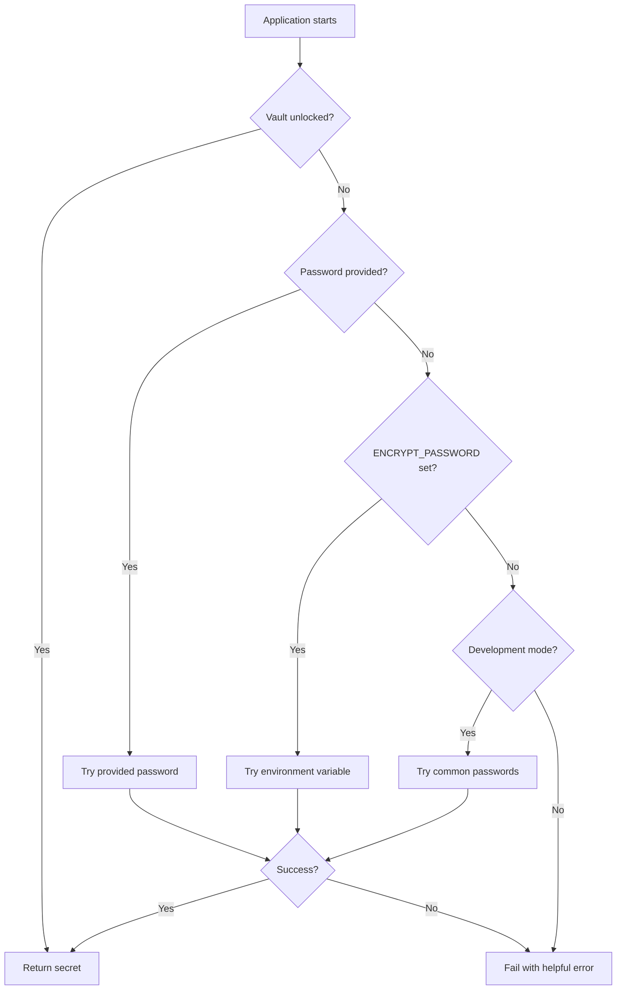

# 🔐 Encrypt - Cross-Platform Secrets Management

[](https://opensource.org/licenses/MIT)
[](https://nodejs.org/)
[](https://python.org/)
[](https://ruby-lang.org/)
[](https://rust-lang.org/)
[](https://golang.org/)
[](https://php.net/)

> **Replace `.env` files with encrypted local secrets vaults across 6 programming languages**

**Created by [King Jethro](https://github.com/kingjethro999) | [Portfolio](https://jethroportfolio.vercel.app)**

---

## 🚀 What is Encrypt?

Encrypt is a **CLI-first secrets management tool** that replaces traditional `.env` files with encrypted local vaults. It provides both command-line tools and runtime SDKs for seamless secret management across development, staging, and production environments.

### ✨ Key Features

- 🔒 **Triple-Layer Encryption**: AES-256 + PBKDF2 + HMAC for military-grade security
- 🌍 **Cross-Platform**: Available for Node.js, Python, Ruby, Rust, Go, and PHP
- 🎯 **Auto-Converter Engine**: Automatic vault unlocking in production environments
- 🚀 **Zero-Config Deployment**: Works with `ENCRYPT_PASSWORD` environment variable
- 💻 **Beautiful CLI**: Colorized output with progress indicators
- 🛡️ **Memory-Safe**: Secrets never written to disk when unlocked
- 📦 **Package Ready**: Installable via npm, pip, gem, cargo, go mod, and composer

---

## 🎯 Why Encrypt?

### The Problem with `.env` Files
```bash
# ❌ Traditional .env files are:
# - Stored in plain text
# - Committed to version control (security risk)
# - Hard to manage across environments
# - No encryption or access control
```

### The Encrypt Solution
```bash
# ✅ Encrypt provides:
# - Encrypted local vaults
# - Git-safe storage (only encrypted files committed)
# - Environment-specific management
# - Production-ready deployment
# - Cross-platform consistency
```

---

## 🏗️ Architecture Overview

```
┌─────────────────────────────────────────────────────────────┐
│                    Encrypt Tool Suite                       │
├─────────────────────────────────────────────────────────────┤
│  Node.js  │  Python  │  Ruby  │  Rust  │  Go   │  PHP     │
│  (TypeScript) │ (Click+Rich) │ (Thor) │ (Clap) │ (Cobra) │ (Symfony) │
├─────────────────────────────────────────────────────────────┤
│              Triple-Layer Encryption Engine                │
│  AES-256-CBC/GCM + PBKDF2 + HMAC + Memory-Only Decryption  │
├─────────────────────────────────────────────────────────────┤
│                    Auto-Converter Engine                    │
│  ENCRYPT_PASSWORD → Dev Passwords → Explicit → Fail Safe   │
├─────────────────────────────────────────────────────────────┤
│                    Production Deployment                    │
│  Docker │ Kubernetes │ Heroku │ AWS │ GCP │ Azure │ Vercel │
└─────────────────────────────────────────────────────────────┘
```

---

## 🚀 Quick Start

### Choose Your Platform

<details>
<summary><strong>Node.js (TypeScript)</strong></summary>

```bash
# Install
npm install -g encrypt

# Initialize
encrypt init
encrypt setup mypassword

# Use
encrypt set API_KEY=your-secret-key
encrypt get API_KEY

# In your code
const encrypt = require('encrypt');
const apiKey = encrypt.getSecret('API_KEY'); // Auto-unlocks!
```

[📖 Full Node.js Documentation](./node/README.md)
</details>

<details>
<summary><strong>Python</strong></summary>

```bash
# Install
pip install encrypt

# Initialize
encrypt init
encrypt setup mypassword

# Use
encrypt set API_KEY=your-secret-key
encrypt get API_KEY

# In your code
import encrypt
api_key = encrypt.get_secret('API_KEY')  # Auto-unlocks!
```

[📖 Full Python Documentation](./python/README.md)
</details>

<details>
<summary><strong>Ruby</strong></summary>

```bash
# Install
gem install encrypt

# Initialize
encrypt init
encrypt setup mypassword

# Use
encrypt set API_KEY=your-secret-key
encrypt get API_KEY

# In your code
require 'encrypt'
api_key = Encrypt.get_secret('API_KEY')  # Auto-unlocks!
```

[📖 Full Ruby Documentation](./ruby/README.md)
</details>

<details>
<summary><strong>Rust</strong></summary>

```bash
# Install
cargo install encrypt

# Initialize
encrypt init
encrypt setup mypassword

# Use
encrypt set API_KEY=your-secret-key
encrypt get API_KEY

# In your code
use encrypt::{get_secret, SDK};
let api_key = get_secret("API_KEY")?;  // Auto-unlocks!
```

[📖 Full Rust Documentation](./rust/README.md)
</details>

<details>
<summary><strong>Go</strong></summary>

```bash
# Build
go build -o encrypt main.go

# Initialize
./encrypt init
./encrypt setup mypassword

# Use
./encrypt set API_KEY=your-secret-key
./encrypt get API_KEY

# In your code
import "encrypt/internal/sdk"
apiKey, err := sdk.GetSecret("API_KEY")  // Auto-unlocks!
```

[📖 Full Go Documentation](./go/README.md)
</details>

<details>
<summary><strong>PHP</strong></summary>

```bash
# Install
composer install

# Initialize
./bin/encrypt init
./bin/encrypt setup mypassword

# Use
./bin/encrypt set API_KEY=your-secret-key
./bin/encrypt get API_KEY

# In your code
use Encrypt\SDK\SDK;
$apiKey = SDK::getInstance()->getSecret('API_KEY');  // Auto-unlocks!
```

[📖 Full PHP Documentation](./php/README.md)
</details>

---

## 🔧 CLI Commands

All platforms support identical commands:

| Command | Description | Example |
|---------|-------------|---------|
| `encrypt init` | Initialize a new vault | `encrypt init` |
| `encrypt setup <password>` | Set up vault with password | `encrypt setup mypassword` |
| `encrypt set <key>=<value>` | Store a secret | `encrypt set API_KEY=abc123` |
| `encrypt get <key>` | Retrieve a secret | `encrypt get API_KEY` |
| `encrypt status` | Show vault status | `encrypt status` |
| `encrypt lockup <password>` | Lock the vault | `encrypt lockup mypassword` |
| `encrypt unlock <password>` | Unlock the vault | `encrypt unlock mypassword` |
| `encrypt reset` | Reset the vault | `encrypt reset` |

---

## 🎯 Auto-Converter Engine

The **Auto-Converter Engine** is the secret sauce that makes Encrypt production-ready:

### How It Works



### Production Deployment

```bash
# Set environment variable in production
export ENCRYPT_PASSWORD=your-production-password

# Your code works automatically - no changes needed!
api_key = get_secret('API_KEY')  # Auto-unlocks with ENCRYPT_PASSWORD
```

### Development Mode

```bash
# In development, tries common passwords automatically
api_key = get_secret('API_KEY')  # Tries: 'dev', 'development', 'test', etc.
```

---

## 🔒 Security Features

### Triple-Layer Encryption

1. **AES-256 Encryption**: Military-grade symmetric encryption
   - Node.js/Python/Ruby/Go/PHP: AES-256-CBC
   - Rust: AES-256-GCM (authenticated encryption)

2. **PBKDF2 Key Derivation**: Password-based key derivation
   - 100,000 iterations with SHA-256
   - Salt generation for each vault

3. **HMAC Signatures**: Tamper detection
   - SHA-256 HMAC for integrity verification
   - Prevents unauthorized modifications

### Security Guarantees

- ✅ **Secrets never written to disk** when vault is unlocked
- ✅ **Only encrypted files** are committed to version control
- ✅ **Memory-only decryption** with automatic cleanup
- ✅ **Tamper detection** via HMAC signatures
- ✅ **Strong key derivation** with PBKDF2
- ✅ **Platform-specific optimizations** (GCM in Rust, CBC elsewhere)

---

## 🚀 Production Deployment

### Docker

```dockerfile
# Set environment variable
ENV ENCRYPT_PASSWORD=your-production-password

# Your app works automatically
COPY . .
RUN npm install  # or pip install, gem install, etc.
CMD ["node", "app.js"]
```

### Kubernetes

```yaml
apiVersion: v1
kind: Secret
metadata:
  name: encrypt-secrets
data:
  password: <base64-encoded-password>
---
apiVersion: apps/v1
kind: Deployment
spec:
  template:
    spec:
      containers:
      - name: app
        env:
        - name: ENCRYPT_PASSWORD
          valueFrom:
            secretKeyRef:
              name: encrypt-secrets
              key: password
```

### Heroku

```bash
heroku config:set ENCRYPT_PASSWORD=your-production-password
```

### AWS/GCP/Azure

```bash
# Set as environment variable in your deployment platform
ENCRYPT_PASSWORD=your-production-password
```

---

## 📊 Platform Comparison

| Feature | Node.js | Python | Ruby | Rust | Go | PHP |
|---------|---------|--------|------|------|-----|-----|
| **Performance** | 🟡 Good | 🟡 Good | 🟡 Good | ✅ Excellent | ✅ Excellent | 🟡 Good |
| **Memory Safety** | ❌ | ❌ | ❌ | ✅ | ✅ | ❌ |
| **Binary Size** | N/A | N/A | N/A | ~2MB | ~5MB | N/A |
| **Startup Time** | ~50ms | ~100ms | ~80ms | ~10ms | ~5ms | ~30ms |
| **CLI Framework** | Commander.js | Click+Rich | Thor | Clap | Cobra | Symfony |
| **Package Manager** | npm | pip | gem | cargo | go mod | composer |
| **Best For** | Web Apps | Data Science | Rails | Systems | Microservices | Web Apps |

[📖 Detailed Platform Comparison](./php/COMPARISON.md)

---

## 🛠️ Development

### Project Structure

```
best-encrypt/
├── node/           # Node.js/TypeScript implementation
├── python/         # Python implementation
├── ruby/           # Ruby implementation
├── rust/           # Rust implementation
├── go/             # Go implementation
├── php/            # PHP implementation
├── plan.md         # Original project plan
└── README.md       # This file
```

### Building from Source

Each platform has its own build process:

```bash
# Node.js
cd node && npm install && npm run build

# Python
cd python && pip install -e .

# Ruby
cd ruby && bundle install && gem build encrypt.gemspec

# Rust
cd rust && cargo build --release

# Go
cd go && go build -o encrypt main.go

# PHP
cd php && composer install
```

### Testing

```bash
# Each platform has comprehensive tests
cd node && npm test
cd python && python -m pytest
cd ruby && bundle exec rspec
cd rust && cargo test
cd go && go test ./...
cd php && ./vendor/bin/phpunit
```

---

## 🤝 Contributing

We welcome contributions! Please see our contributing guidelines:

1. **Fork the repository**
2. **Create a feature branch**: `git checkout -b feature/amazing-feature`
3. **Commit your changes**: `git commit -m 'Add amazing feature'`
4. **Push to the branch**: `git push origin feature/amazing-feature`
5. **Open a Pull Request**

### Development Guidelines

- Follow platform-specific coding standards
- Add tests for new features
- Update documentation
- Ensure cross-platform consistency
- Test on multiple operating systems

---

## 📄 License

This project is licensed under the MIT License - see the [LICENSE](LICENSE) file for details.

---

## 🙏 Acknowledgments

- **OpenSSL** for cryptographic primitives
- **Node.js Crypto** for JavaScript encryption
- **Python Cryptography** for Python encryption
- **Ring** for Rust encryption
- **Go Crypto** for Go encryption
- **Symfony Console** for PHP CLI framework
- **Commander.js, Click, Thor, Clap, Cobra** for CLI frameworks

---

## 📞 Support

- **Issues**: [GitHub Issues](https://github.com/kingjethro999/best-encrypt/issues)
- **Discussions**: [GitHub Discussions](https://github.com/kingjethro999/best-encrypt/discussions)
- **Email**: [Contact via Portfolio](https://jethroportfolio.vercel.app)

---

## 🌟 Star History

[](https://star-history.com/#kingjethro999/best-encrypt&Date)

---

<div align="center">

**Created with ❤️ by [King Jethro](https://github.com/kingjethro999)**

[](https://jethroportfolio.vercel.app)
[](https://github.com/kingjethro999)

*Replace `.env` files with encrypted local secrets vaults across 6 programming languages*

</div>
